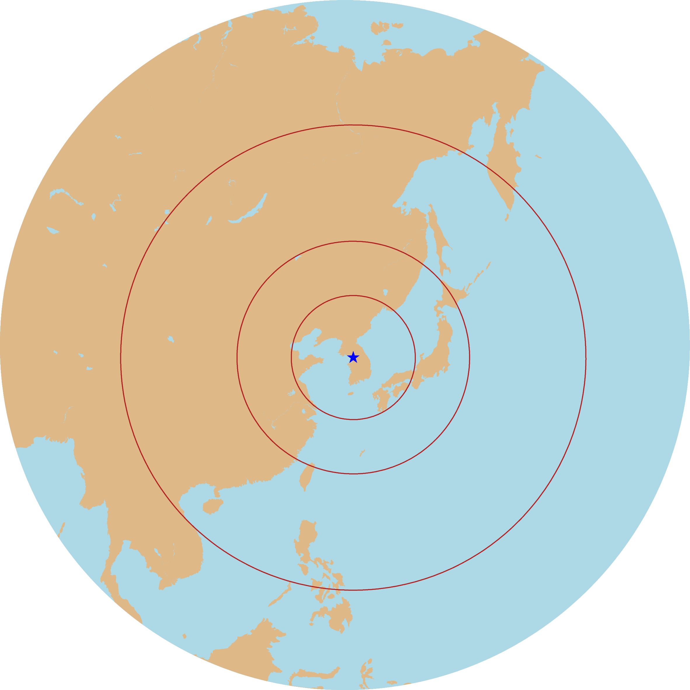

# Geodata Pipeline Recipes

Recipes for geodata pipelines for workflow frameworks such as [Nextflow](https://www.nextflow.io/). These workflows are heavily dependent on CLI tools such as [ogr/gdal](https://gdal.org/), [osmium](https://osmcode.org/osmium-tool/), [GMT](https://www.generic-mapping-tools.org/) and so on. 

Utilizing Nextflow gives
- better readability
- easier Docker use
- partial run (resume after failure)
- concurrent execution

## Examples

### Display all restaurants in New Caledonia, Fiji, Vanuatu

[https://github.com/yonghah/geodata-pipeline/blob/main/nextflow/osm/download-filter-merge.nf](https://github.com/yonghah/geodata-pipeline/blob/main/nextflow/osm/download-filter-merge.nf)

Download PBF from OpenStreetMap (download-osm); extract POI from the PBFs (osmium); create GeoJSON (ogr2ogr) and CSV (jq)

### Create shaded relief

[https://github.com/yonghah/geodata-pipeline/blob/main/nextflow/shaded_relief/shaded_relief.nf](https://github.com/yonghah/geodata-pipeline/blob/main/nextflow/shaded_relief/shaded_relief.nf)

Use downloaded SRTM from USGS; merge tiff (gdal_translate); rescale and reproject (gdalwarp); and generate hillshade (gdaldem)

### Use with GMT 

#### GMT Hello World

[https://github.com/yonghah/geodata-pipeline/blob/main/nextflow/gmt/helloworld/helloworld.nf](https://github.com/yonghah/geodata-pipeline/blob/main/nextflow/gmt/helloworld/helloworld.nf)

#### Display Point Data

[https://github.com/yonghah/geodata-pipeline/blob/main/nextflow/gmt/pointplot/pointplot.nf](https://github.com/yonghah/geodata-pipeline/blob/main/nextflow/gmt/pointplot/pointplot.nf)

#### Range from a city

[https://github.com/yonghah/geodata-pipeline/blob/main/nextflow/gmt/range/range.nf](https://github.com/yonghah/geodata-pipeline/blob/main/nextflow/gmt/range/range.nf)

